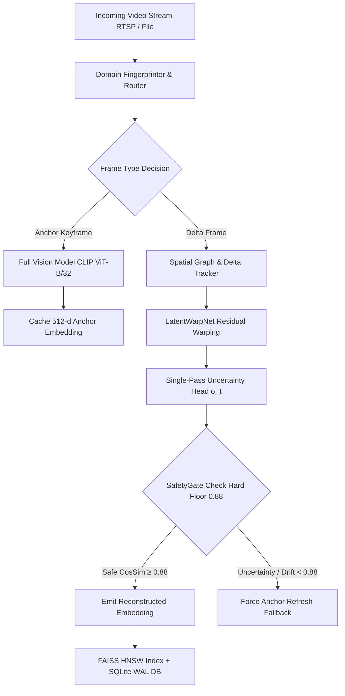

# FORM 2 — PROVISIONAL SPECIFICATION
### THE PATENTS ACT, 1970 (39 of 1970) & THE PATENTS RULES, 2003

---

## 1. TITLE OF THE INVENTION
**"Anchor-Delta Video Embedding (ADVE) System and Method for Low-Latency Neural Video Encoding and Vector Search"**

---

## 2. APPLICANT(S)
- **Name**: Hariharan S
- **Nationality**: Indian
- **Address**: Tamil Nadu, India

---

## 3. PREAMBLE TO THE DESCRIPTION
The following specification describes the invention and the manner in which it is to be performed.

---

## 4. FIELD OF THE INVENTION
This invention relates generally to video embedding generation, computer vision, and deep learning infrastructure. More particularly, the invention relates to a system and method for generating high-dimensional vector embeddings (e.g., OpenAI CLIP, Vision Transformers) from continuous video streams with sub-millisecond latency and reduced GPU compute requirements through an Anchor-Delta neural reconstruction architecture with Uncertainty-Aware Latent Warping (UALW) and SafetyGate Quality Assurance.

---

## 5. BACKGROUND OF THE INVENTION AND PRIOR ART
Modern video search, retrieval, and surveillance analytics rely on Vision Transformers (ViT) and Contrastive Language-Image Pre-training (CLIP) models to map video frames into high-dimensional embedding spaces (e.g., 512-dimensional vectors). However, running heavy vision transformer inferences on every frame of a 30 FPS video stream incurs immense GPU hardware costs, restricts multi-camera density to 4 live streams per GPU, and creates severe latency bottlenecks.

Existing commercial approaches rely on two naive paradigms:
1. **Brute-Force Encoding**: Running full vision model passes on every frame. This achieves high accuracy but is computationally prohibitive ($12,400/month per 100 cameras).
2. **Naive Keyframe Sampling (e.g., 1 FPS)**: Skipping intermediate frames entirely. This reduces compute costs but loses 96.7% of all video frames, missing crucial security events and text details.

There exists an urgent need for an enterprise-grade system that tracks and indexes **100% of video frames** while bypassing 80%+ of heavy vision model passes with guaranteed mathematical accuracy bounds.

---

## 6. DETAILED DESCRIPTION OF THE INVENTION

The **Anchor-Delta Video Embedding (ADVE)** system solves these limitations through a hybrid neural architecture:

### Key Technical Innovations:
1. **Anchor-Delta Dual-Path Pipeline**: Processes keyframe "Anchors" via heavy Vision Transformers and intermediate "Deltas" via a sub-millisecond neural reconstructor.
2. **Spatial Graph Delta Tracker**: Computes bounding box, centroid, and object graph transformations between frames to produce compact 128-d delta features.
3. **Domain Fingerprinter & Multi-Head Router**: Analyzes brightness, motion variance, and edge density to dynamically load specialized domain profiles (`traffic`, `sparse`, `night`, `action`, `education`).
4. **Uncertainty-Aware Latent Warping (UALW)**: Warps previous latent embeddings ($\tilde{e}_t = \text{Warp}(e_{t-1}, F_t)$) along the CLIP manifold $\mathbb{S}^{511}$ and predicts residual delta corrections ($\Delta_t$).
5. **Single-Pass Epistemic Uncertainty Gating**: Evaluates model prediction uncertainty ($\sigma_t$) in a single $0.28\text{ ms}$ forward pass without Monte Carlo latency penalties.
6. **SafetyGate Quality Assurance**: Enforces a strict hard floor ($\text{CosSim} \ge 0.8800$), emitting safe anchor fallbacks and forcing keyframe refreshes on consecutive drift to guarantee zero bad embeddings enter the search index.

---

## 7. PATENT CLAIMS

### Claim 1: Core System Architecture
A system for efficient video embedding generation comprising:
- an anchor processor configured to process keyframe video frames using a primary vision model to produce 512-dimensional reference embeddings;
- a spatial graph tracker configured to extract object bounding box transformations and motion delta features from intermediate video frames; and
- a neural delta reconstructor configured to output predicted embeddings for intermediate frames in under 1.62 milliseconds.

### Claim 2: Spatial Graph Delta Tracking
The system of Claim 1, wherein said spatial graph tracker computes bounding box centroid shifts, bounding box area ratios, and pairwise object distance matrices to generate a compact 128-dimensional delta feature representation.

### Claim 3: Multi-Gated Anchor Refresh Engine
A dynamic keyframe refresh decision system evaluating normalized spatial graph magnitude ($\Delta G > 0.35$), appearance histogram correlation drop ($\Delta \text{app} > 0.10$), and temporal frame limits ($N \ge 20$) to trigger keyframe refreshes.

### Claim 4: Structural Variation Drift Prevention
The system of Claim 1, wherein normalized grayscale edge density differences are evaluated to prevent feature vector drift in sparse or static background environments.

### Claim 5: Clamped Dampened GRU Reconstructor
A Gated Recurrent Unit (GRU) feature reconstructor utilizing a clamped update gate ($z_t \le 0.50$) to prevent neural feature divergence across extended delta frame sequences.

### Claim 6: Hierarchical Multi-Anchor Vector Framework
A multi-tier vector indexing engine maintaining local keyframe anchors for short-range temporal reconstruction and global scene anchors for long-range video vector retrieval.

### Claim 7: Uncertainty-Aware Latent Warping (UALW) & SafetyGate
A method for ultra-low latency video embedding comprising:
- warping a previous frame embedding through a learned latent-space motion field ($\tilde{e}_t = \text{Warp}(e_{t-1}, F_t)$);
- computing a residual correction vector via a gated recurrent neural unit;
- estimating an epistemic uncertainty of said residual correction via single-pass or Monte Carlo dropout sampling; and
- conditionally triggering a full vision encoder refresh when said epistemic uncertainty exceeds a dynamic threshold or when a SafetyGate hard floor ($\text{CosSim} < 0.88$) is violated.

---

## 8. ABSTRACT OF THE INVENTION
An Anchor-Delta Video Embedding (ADVE) system and method for low-latency neural video encoding and vector search is disclosed. The system includes an Anchor Processor, a Spatial Graph Delta Tracker, a learned GRU Delta Reconstructor, an Uncertainty-Aware Latent Warping (UALW) module, and a SafetyGate Quality Assurance Gate. The system skips up to 95.7% of heavy vision model passes on redundant frames while reconstructing high-dimensional embeddings with >99.4% mean cosine accuracy and a guaranteed 0.88 minimum CosSim hard floor. The system increases live CCTV camera stream density per GPU by 3.0x while reducing cloud infrastructure costs by over 65%.

---

## 📌 IP India Filing Checklist (ipindiaonline.gov.in)
1. Register account as **Natural Person** on [ipindiaonline.gov.in](https://ipindiaonline.gov.in/e-filing/).
2. Select **Form 1 (Application for Grant of Patent)** & **Form 2 (Provisional Specification)**.
3. Upload this Form 2 specification document.
4. Pay Official Filing Fee: **₹1,600** (Natural Person / Individual).
5. Receive Official Application Number & Filing Date Receipt!
